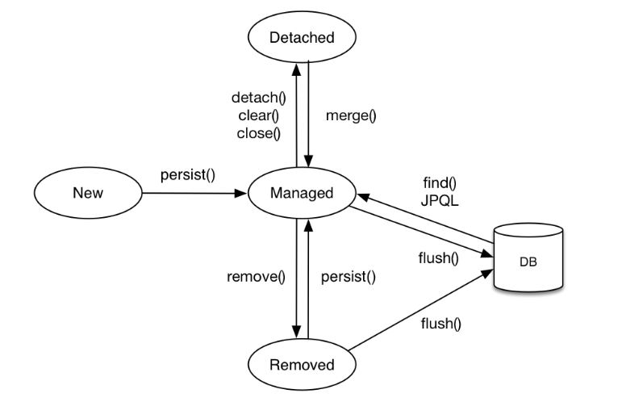

# JPA Study 

## reference 
- inflearn 실전! 스프링 데이터 JPA


## gradle 
- gradlew.bat dependencies --configuration compileClasspath - 의존 관계확인 가능 


## JPA
- 영속 상태 변화
  
  
  - new/transient: 영속성 컨텍스트와 상관없는 새로운 상태
  - managed: 연속성 컨텍스트에 관리되는 상태
  - detached: 영속성 컨텍스트에 저장되었다가 분리된 상태 
  - removed: 삭제된 상태 
  - persist, remove, .. 등은 entityManager에서 호출 가능하고 영속성 상태를 변경하는 역할을 한다. 추가적으로 Trascation이 Commit 되면 Managed 에 있는 쿼리가 DB로 날라간다.
- JPA vs Spring Data JPA
    - JPA: Entity Manager를 User 가 Control 해야 한다. 
    - Spring Data JPA: Spring 이 알아서 Entity Manager를 이용해 CRUD Paging 등 구현 한다.
- HikariCP - database connection pool 로 성능 issue 있을시 설정을 해야 한다. 
- entity 의 경우 Default 생성자가 있어야 하는데 Proxy 기술이 사용되기 위해서는 접근자가 Protected 는 되어야 한다. 
- dirty checking: Proxy 가 @Transactional 에 의 Commit 되는데 변경을 감지해서 알아서 Update 쿼리를 날린다. basicCRUD 참조
- @SpringBootApplication 가 있으면 @EnableJpaRepositories 설정을 안해줘도 되는데 .. SpringBootApplication 어노테이션이 기본적으로 org.yg.study.JPAsample <br />
하위 패키지에 대해 EnableJpaRepositories 설정을 적용 해준다.
- [QueryMethod](https://docs.spring.io/spring-data/jpa/docs/current/reference/html/#jpa.query-methods)
- Named Query : Entity 에 Query 이름과 JPQL을 지정하여 Query 이름으로 쿼리를 할수 있다(JPA 의 경우) 거의 안씀.. NamedQuery를 쓰면 프로그램 로딩시에 SQL 을 파싱함으로 SQL 문에 오타가 있는지 알 수 있다. 
  Repository 에 @Query 에 SQL 문을 쓰는 경우도 마찬가지로 로딩시 SQL 문 오타를 잡을 수 있음  
- JPQL
  ```
  :[Parameter Name 이름기반] "select m from Member m where m.username = :username"
  ?[Parameter Order 위치기반] "select m from Member m where m.username = ?1"
  DTO 로 반환시 "select new org.yg.study.JPAsample.dto.MemberDto(m.id, m.username, t.name) from Member m join Team t".
  or List<Object[]> 형식으로 ...
  QueryDSL **** 중요 !! 실무에서는 이게 가장 깔끔하다고함
  ``` 
- 반환데이터가 없을지 있을지 모를땐  Optional(orElse, orElseGet) 을 사용하자 
- [Spring data JPA 지원하는 Retrun Type](https://docs.spring.io/spring-data/jpa/docs/current/reference/html/#repository-query-return-types)
- jpa.properties.hibernate.dialect: org.hibernate.dialect.O.... 해당 DB에 맞게 Query가 나감 
- Page 의 total count 쿼리는 고비용이다 그래서 실무 사용에서 주의 해야 한다. Page 인덱스는 0 부터 
- Slice 는 Page 의 토탈카운트가 없다. 
- Entity 는 절대 외부로 노출하지 않는다. DTO 로 변환해서 한다. DTO 내부에서도 Entity를 절대 그냥 써선 안된다. 
- 벌크성 수정 쿼리 update 로 하는데 update 시 @Modifying(clearAutomatically = true) 을 이렇게 해서 영속성 컨텍스트를 클리어 해야 DB 와 동기를 맞출 수 있다. 
- Fetch Join N:1 문제를 해결 "select m from Member m left join fetch m.team" 이런식으로 사용하며 이렇게 할 시 쿼리에 다른 테이블을 join 하여 날리고 테이블 데이터를 다 긁어 옴 한마디로 연관관계에 있는 테이블 데이터를 모조리 가져온다. 
  - EntityGragh 는 Fetch Join 을 JPQL 없이 깔끔하게 해결 해준다. 
- JPA Hint: JPA 구현체에게 날리는 힌트 
  - JPA 에서 엔티티를 조회하면 조회 상태 그대로 Snap Shot을 만들어 놓는다. 그리고 트랜젝션이 끝나는 시점 flush 시점에 Snap Shot 과 다른 점을 조회 하여 변경 사항이 있으면 Update 쿼리를 날린다. 
  - 여기서 스냅샷을 안 만들게 하여 성능에 이점을 가져갈 수 있는데 이때 JPA Hists를 쓴다.(Hibernate 기능) 
- Auditing 추적 => MappedSupperClass
- MappedSuperClass - 속성만 내린다. 테이블 성격이 모두 다름으로 .. 성격에 따라 쪼개는게 필요 한다. 
- Web 확장 memberController /members 참고
- data.web.pagable.default-page-size 로 default page를 바꿀수 있다. 
- 서비스 계층에서 트랜잭션을 시작하지 않으면 리파지토리에서 트랜젝션 시작 
- @Transaction(readOnly = true) - Flush 를 하지 않는다. 즉 변경사항을 DB로 보내지 않는다. 
- Entity에 GeneratedValue 가 없이 PK 를 직접 지정하여 Save 하면 em.merger 로 Save 가 동작한다. 이렇게 되면 조회 후 insert 함으로 성능에 손해다
  - Entity에서 Persistable 을 구현하여 isNew 의 조건을 구현한다. 
- Collection 을 Fetch Join 하면 Paging 이 안된다. 그리고 1: N Fetch Join 시 Paging과 비슷하게 setFistResult(1), setMaxResult(100) 이런식으로 사용하게 되면 모든 DB를 메모리에서 읽고 메모리에서 Paging 기능을 함으로 매우 위험하다.(OutOfMemory 발생 가능)
추가로 2개 이상의 컬렉션(1:N:M => 1*N*M 개)에 대한 Fetch Join할 경우 문제 발생의 소지가 있으니 피해야 한다.
  - Fetch Join 을 많이 하게 되면 Application으로 보내지는 데이터(중복데이터) 가 많아질수 있다. 
- 컬렉션 패치 조인시 Paging을 사용하는 방법 
  1. ToOne(OneToOne, ManyToOne) 관계를 모두 패치 조인 한다. (ToOne 관계는 row 를 증가 시키지 않음으로)
  2. 컬랙션은(ToMany) 지연 로딩한다.
  3. 지연 로팅 성능 최적화를 위해 "hibernate.default_batch_fetch_size", "@BatchSize" 를 적용한다.
    - hibernate.default_batch_fetch_size 를 적용하면 size 만큼 In 절을 써서 한번에 땡겨온다. Global
    - Specific 하게 할때는 @BatchSize 를 이용 
- 엔티티 조회하는 방식을 채용하면 코드 복잡도를 줄이고 성능 최적화를 할 수 있다. 
- Open Session In View(OSIV): 하이버네이트 
  - open-in-view defualt true 인데 이 경우 Transaction 이 수행될때 DB Connection을 획득(영속성 Context 유지)하고 Response가 나갈때까지 Connection을 들고 있다.
    - 장점: Controller, View 단에서 지연로딩을 사용할 수 있다.
    - 단점: Connection Resource 가 말라버릴 수 있다. 
  - false 인 경우엔 Service 단에서 Transaction 이 끝나면 영속성 Context를 날린다.
    - 장점: Connection Resource 를 절약 가능 
    - 단점: 만약 지연로딩을 Controller에서 했다면 장애가 발생한다. (Controller에서 지연로딩이 안되기 때문에 ) Service 단에서 데이터를 모두 조회해 놔야 한다.
  - 트레픽이 많은 서비스의 경우는 OSIV를 꺼는게 좋다. 
  - ADMIN 시스템의 경우는 OSIV를 켜서 코딩을 좀더 쉽게 하는게 좋다. 
- JPQL 서브쿼리는 from 절의 sub 쿼리는 지원하지 않는다. 사실 select 절의 subquery 도 않되나 이는 하이버네이트가 지원해줌 
  - 서브쿼리는 높은 확률로 join으로 변경 가능하다. 
  - 쿼리 두번 실행 
  - native sql 
### Query DSL 
- QueryDslTest 참조 
- https://www.inflearn.com/course/Querydsl-%EC%8B%A4%EC%A0%84/lecture/30125?tab=curriculum
- 스프링 데이터 페이지 활용 3 컨트롤러 개발  
- Custom Reposiotry


### 참조 
- https://lifeonroom.com/study-lab/spring-boot-jpa-1/
- https://lifeonroom.com/study-lab/spring-boot-jpa-2/
- https://lifeonroom.com/study-lab/spring-boot-jpa-3/
- https://github.com/hog225/study-spring-boot/blob/master/memo/README.md // 코드도 같이 참조 .. 
  