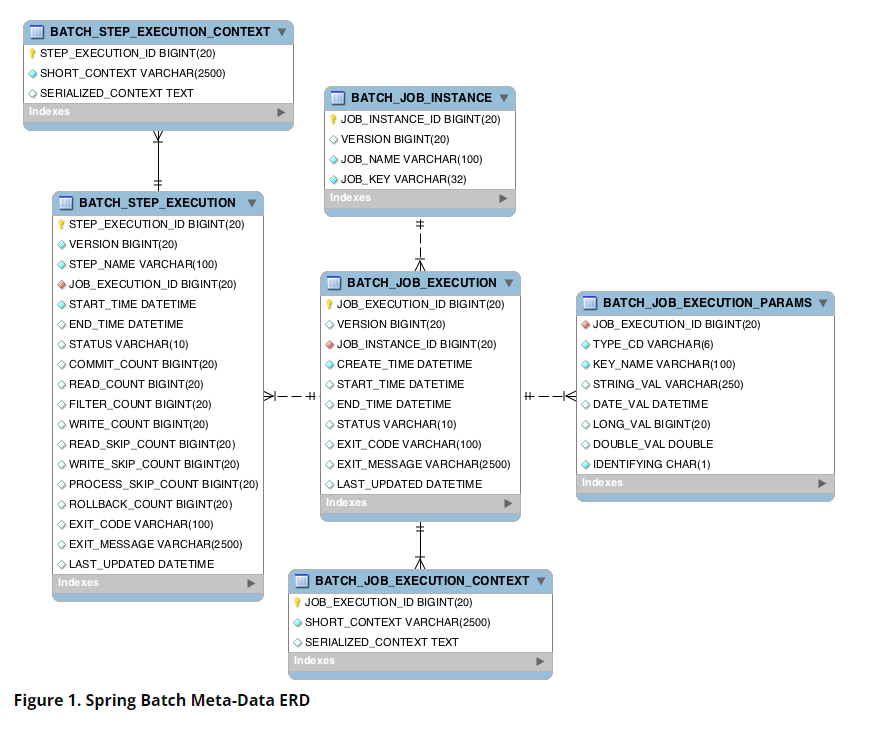

# Spring Batch

## 들어가기 전에 ...
1. Spring Batch 의 도메인을 잘 이해 해야 한다.
2. chunk: 많은 데이터를 일정한 크기 단위로 데이터를 읽고 쓰는 프로세스
3. 오류제어
4. Batch 는 기본적으로 Single Thread 이다. 하지만 멀티로도 할 수 있다.
5. 리스너
6. 테스트

## 배치 패턴
1. read -> Process -> write
2. ETL 과 비슷 extract, transfort, load(적재)

## 구성
1. application
2. batch core -JobLauncher, job, Step, Flow / job을 설정하고 구성하는
   1. job은 반듯이 step을 가져야 한다. 
   2. step 안에서 비지니스 로직을 구현하는 단위 
   3. SimpleStepHandler 에서 step 이 실행됨
   4. Simple JobLauncher job 을 실행 시킴 
3. batch infrastructure - data르 처리하고 핸들링하는 queu, json 등등 

## 초기화 클래스 
1. BatchAutoConfiguration
2. SimpleBatchConfiguration
3. BatchConfigureConfiguration
   1. BasicBatchConfigurer
   2. JpaBatchConfigurer

## 스프링 배치 메타 데이터
* 스프링 배치의 실행 및 관리를 목적으로 여러 도메인들의 정보들을 저장 업데이트 조회 할 수 있는 스키마 제공 
- spring.batch.jdbc.initialize-schema 
  - ALWAYS: 운영에서는 위험 
  - EMBEDDED : 내부 DB에만 생성됨
  - NEVER: 수동 생성 
- Job 관련 테이블 
  - instance - job name, job key ==> key 
  - excution - job 의 실행정보가 저장 
  - excution_params - job param 저장 
  - excution_context - 상태정보 공유 데이터를 직렬화 해서 저장 
- step
  - excution - 생성 정보, 공유 데이터 
  - excution_context


- https://docs.spring.io/spring-batch/docs/current/reference/html/schema-appendix.html#metaDataSchema

## Job

1. JobLauncherApplicationRunner
   1. Job 을 실행시킨다. 
2. Batch Properties 
   1. Spring Batch 의 환경 설정 클래스 
3. Job 실행 옵션 
   1. Program Argument 로 입력 가능 
4. JobBuilderFactory 
   1. Spring Batch가 Job 을 생성하게 할수 있는 클래스 생성을 위임 
   2. simpleJobBuilder
   3. flowJobBuilder
### Job 생성 플로우 
jobBUilderFactory -> jobBuilder -> Tasklett->SimpleJobBuilder (start, next, on, split 등ㅡㅇ)-> SimpleJob
-------------------------------------------->flowJobBuilder -> JobFlowBuilder -> FlowBuilder

1. SimpleJob 
   1. 여렇개의 Step 으로 이루어짐 한개 Step 이 실패시 다음 스텝은 실행되지 않음 
   2. 아래와 같이 생성
   ```
   jobBuilderFactory.get("job 이름")
   .start(step) // simplejobBuilder 가 생성되고 반환됨 
   .next(step) // 다음에 실행할 Step 을 순차적으로 연결 
   .increment(JobParameterIncrementer) //job parameter 를 증가시켜 준다. 
   .preventRestart(true) // 잡을 재실행 할지 말지 false 면 job 이 실패해도 재시작을 시킬 수 없음 
   .validator(jobParameterValidator) // jobparameter 검증 DefaultJobparameterValidator
   .listener(JobExcutionListener)
   .build()
   ```
   jobLauncher -jobparameter-jobinstance-JobExcution-> simplejob -jobListner-> step -StepExcution-ExcutionContext-> taklet
   
2. Job parameter 
```
  1. --job.name=batchjob name=user1 요렇게 줄 수 있다. 
```

   2. job parameter 롤 job을 식별함으로 job parameter를 자동 증가시켜 job을 계속 실행 시켜줄 수 있다. 

## Step
1. StepBuilderFactory
   1. StepBuilder
      1. TaskletStepBuilder
      2. SimpleStepBuilder - chunk 기반 처리 ChunkOrientedTasklet 클래스를 생성한다. (Chunk) 
      3. PartitionStepBuilder 멀티 스레드 방식으로 Job 을실행 
      4. JobStepBuilder JobStep을 생성하여 Step 안에서 Job을 실행한다. 
      5. FlowStepBuilder
      6. 인자에 따라 다르게 생성됨

진도 StepBuildFactory ---- 15:45

2. taskletstep
   1. repeatTemplate 을 사용 
   2. Task 와 chunk 기반으로 나눠서 실행 
   3. 일반적인 tasklet 과 chunk oriented 한 tasklet 이 존재 
      1. chunk 하나의 큰 덩어리를 쪼개서 실행 예) 대용양의 디비 처리를 좀 나눠서 처리 한다. 
         1. itemReader, itemWriter, itemProcessor
      2. Task 기반: 단일 작업 댜량 처리는 좀 복잡함 대용량 처리는 chunk 기반을 추천 
   
   4. stepBuilderFactory > StepBuilder > TaskletStepBuilder > TaskletStep
   ```
   stepBuilderFactory.get("batchstep")
   .tasklet(tasklet)
   .startLimit() // 실행 회수 설정 실행 회수 초과시 Exception 발생  
   .allowStartIfComplete // 실패하든 성공하든 재시작 
   .listener() //callback 
   .build()
   ```
   5. step 이 teaklet 을 수행 
      1. tasklet 은 리핏 스테이터스 혹은 예외가 발생할때 까지 계속 돈다. 
   6. Step 은 오직 한개의 Tasklet 만 수행한다. 
   7. job -> step -> repeatTemplate -> Tasklet -> Bussiness Logic -> Exception
   8. taskletstep 실행
   9. 

## flow 
Job의 일종 
1. Step 을 순차적으로 구성하는게 아니라 조건에 따라 흐름을 전환해야 하는 경우 
2. 사용처 
   1. step 이 실패 하더라도 job은 계속 수행되도록 해야 하는 경우 
   2. step 이 성공 했을때 다음 step 을 구분해서 실행 해야 하는 경우 
   3. 특정 스텝은 전혀 실행 시켜선 안되는 경우 
3. SimpleJob 과 마찬가지로 JobBuilderFactory 로부터 생성된다. 
```java
jobBuilderFactory.get("batchJob")
        .start(step)
        .on(string pattern) // step 의 종료상태를 캐치함 ExsitStatus 와 메칭한다. 
        .to(step) //다음으로 실행할 단계를 지정 
        .stop() / .fail() / .end() / StopAndRestart()
        .from(step) // 추가 transition
        .next(step)
        .end()
        .build()

```
4. BatchStatus, ExistStatus, FlowExcutionStatus
   1. BatchStatus - job, step excution 의 속성 ( job 과 step 이 어떻게 종료되었는지를 저장 )
   2. FlowExcutionStatus 값은 Step 의 ExitStatus 값으로 이루어짐 
   3. 마지막 flow 의 값이 최종 flow 의 상태값이 된다. 
5. batch status : completed, starting, started, stopping, stoped, failed, abondon, unknown,
6. exit status : 종료가 어떤 상태로 되었는지 unknown, excuting, completed noop failed stopped 
7. flow Excution status : flow 최종 실행 결과가 무엇인지 지정 
8. Transition 조건에 따라 플로우를 다르게 할 수 있는 기능 

9. 스프링 배치 - 빈의 실행 시점에 빈이 생성 된다. 일반적인 싱글톤 패턴이랑은 다름 
10. 어플리케이션 구동 시점엔 Proxy Bean 이 생성된다. 
11. 쓰레드 마다 생성된 스코프 빈이 할당 되기 때문에 thread safe 하다. 
12. jobScope, stepScope @Value 를 사용하고 싶을떄 사용 

## chunk 
1. 여러개의 아이템을 묶은 하나의 덩어리 혹은 블록
2. chunk 단위로 commit 과 rollback 이 이루어짐 
3. Chunk 종류 
   1. chunk<I> item reader 에서 읽은 아이템을 chunk 에서 정한 갯수만큼 반복해서 저장하는 타입 
   2. chunk<o> item reader 에서 받은 데이터를 item processor 에서 적절하게 가공한 뒤 필터링하여 item writer 에게 전달 

   
4. itemStream - 파일등을 읽어서 처리하고 싶을때 