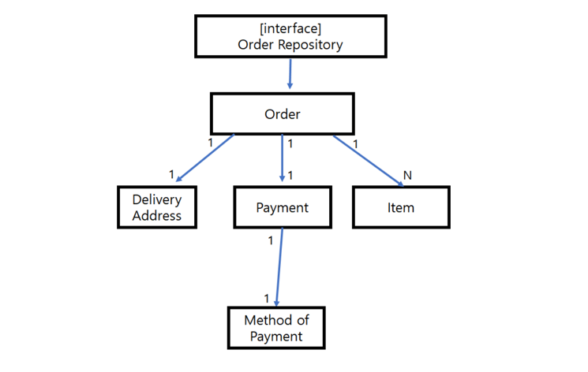

# Restbucks

1. https://github.com/odrotbohm/spring-restbucks
2. 설명 https://odrotbohm.de/2021/04/Spring-RESTBucks-in-2021/

## Annotation
- EnableAsync: 메서드 비동기 처리를 가능하게 해준다. 

## DDD 
- Aggregate root : 연관 객체의 묶음을 aggregate 라고 하고 이에대한 상위 Entity 에 대해서 aggregate 루트 라고 한다. 보통 aggreate root 에 대해서만 Repository 를 만든다. 
- 
- order : aggregate root https://eocoding.tistory.com/36 c참조
- DomainEventHandler

https://github.com/hantsy/spring-r2dbc-sample