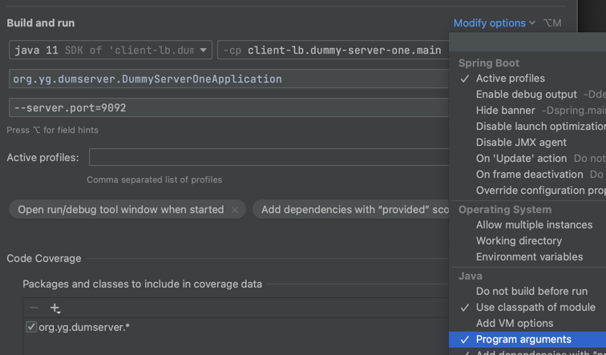

# Client LB

## Netflix Ribbon

### API 
curl localhost:8888/server-location

### 서버 
* dummy server 두개 시작 

## Spring Integration
* serverCF 는 서버
* clientCF 는 클라이언트 tcpOutGate 
* tcpOutGate 왜 inputChannel 일까 ? 
* Gateway (SimpleGateway) -> Channel -> TcpOutboundGateway -> <==Socket==> -> TcpInboundGateway -> Channel -> ServiceActivator (EchoService)

### Config.java
* 주석 해지 하고
* python 소켓 서버 돌린뒤에 
* Telnet 으로 접속 한다. 